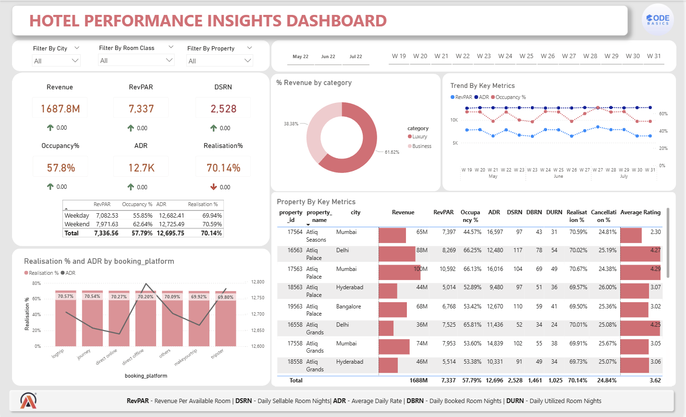

# 📊 Hospitality Revenue Dashboard

## 📌 Overview

This Power BI dashboard analyzes hotel performance metrics.

## 📊 Key Metrics

* Revenue
* RevPAR
* ADR (Average Daily Rate)
* Occupancy %
* Realisation %

## 🛠️ Tools Used

* Power BI
* Excel

## 📷 Dashboard Preview

## 🚀 Insights

* Identified peak booking periods
* Compared platform performance
* Analyzed revenue trends

## 📌 Skills Demonstrated

* Data Visualization
* Dashboard Design
* Business Intelligence

## 📌 Note

This project is re-uploaded due to temporary loss of access to my previous GitHub account.
